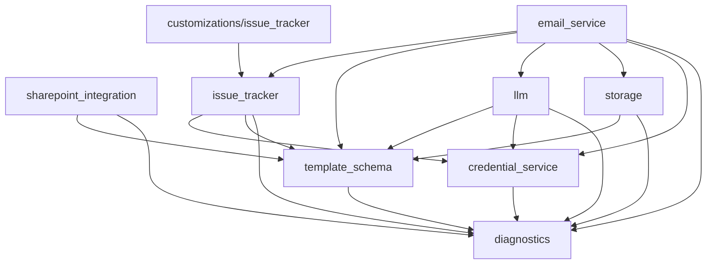

# System map

_Generated 2026-05-28 by regen-map. Do not hand-edit._

## Modules

| Module | Purpose | Status |
|---|---|---|
| [credential_service](../../core/src/credential_service/MODULE.md) | Single read-only interface (`get_credential(pm_id, system_type) -> Credential`) that returns the credential material every outbound adapter needs to authenticate against external systems. | [DRAFT] |
| [diagnostics](../../core/src/diagnostics/MODULE.md) | Central registry and schema library for HILDA's chat-mediated collaboration surface. Owns the error-code prefix registry, the four compact report types (RPT / MET / FIX / QC), and the fixed-field QC template base class. | [DRAFT] |
| [email_service](../../core/src/email_service/MODULE.md) | All email-mediated communication for HILDA — inbound owner replies (FR-12), inbound SP-alert notifications (`[D-047]`), outbound owner outreach (FR-9), outbound reminders + escalations (FR-10), and the FR-52 attachment-routing driver. | [DRAFT] |
| [issue_tracker](../../core/src/issue_tracker/MODULE.md) | Implements the `IssueTracker` Protocol per `[D-008]` — issue-tracking integration for DeliveryItems whose `tracking_modality` includes `CorporatePLM` or `CustomerJIRA`. Two adapter targets in Ph-1: corp PLM (via gateway) + customer JIRA. | [DRAFT] |
| [llm](../../core/src/llm/MODULE.md) | Single Protocol-mediated surface (`LLMProvider`) for every runtime LLM call HILDA makes — doc_type classification, attachment routing, new-vs-revision classification, document quality review, message classification fallback. | [DRAFT] |
| [sharepoint_integration](../../core/src/sharepoint_integration/MODULE.md) | All SharePoint 2017 REST API interaction for HILDA — entity CRUD on SP Lists, NTLM/Kerberos authentication, and the mapping from HILDA's canonical entity fields to customer-deployment-specific SP list names and column names. | [DRAFT] |
| [storage](../../core/src/storage/MODULE.md) | Owns HILDA's internal persistence — Postgres for the document index, CommunicationLog, BATCH-id idempotency cache, FR-31 runtime overrides, and Celery result backend; Redis client; NSD SMB client for the two-tree document store. | [DRAFT] |
| [template_schema](../../core/src/template_schema/MODULE.md) | Canonical data model for HILDA's entity hierarchy — Device / Milestone / DeliveryItem (grouped by tg_name) + TG-group metadata — and the contract types shared across all runtime modules. | [DRAFT] |
| [customizations/issue_tracker](../../customizations/issue_tracker/MODULE.md) | Drop-in directory for proprietary IssueTracker adapters generated by the API Spec Ingestor and human-completed (Cline). | [DRAFT] |

## Dependency graph



## Layer summary

- **Layer 0 (foundation, no HILDA imports)**: `diagnostics`.
- **Layer 1 (depends only on foundation)**: `template_schema`, `credential_service`, `sharepoint_integration`, `storage`, `llm`, `issue_tracker`. All 7 fully reviewed as of 2026-05-28.
- **Layer 2 (orchestration; depends on Layer 1)**: `email_service` (drafted 2026-05-28; review pending). Remaining: `messenger`, `workflow_engine`, `customer_adapter`, `rule_engine`, `test_report`.
- **Layer 3 (higher-level + build-time)**: `tracker`, `template_schema_ingestor`, `api_spec_ingestor`, `test_report_profiler`.
- **Layer 4 (UI)**: `dashboard`.
- **Layer 5 (corp-side gateway PCs)**: `corp_messenger_gateway`, `corp_plm_gateway`.

Total Ph-1 module roster per `[D-021]` impl note 2026-05-24: **20 modules** (18 HILDA-PC in-process + 2 corp-side gateway PCs).

## Project file structure

_Alphabetical, regenerated by regen-map. Directory descriptions come from MODULE.md Purpose; file descriptions come from the per-language description-source rule in structure-conventions.md._

```
hilda/
├── HILDA_Design.md                              # Conceptual/narrative design — onboarding doc for humans
├── cline-playbooks/                             # Cline Student-LLM playbook recipes
│   ├── develop-issue-tracker-adapter.md
│   ├── placeholder-convention.md
│   └── sp-connect.md
├── core/
│   └── src/
│       ├── credential_service/                  # Single read-only interface returning credentials for outbound adapters
│       │   └── MODULE.md
│       ├── diagnostics/                         # Central registry and schema library for HILDA's chat-mediated collaboration surface
│       │   ├── MODULE.md
│       │   ├── __init__.py
│       │   ├── diagnostics_cli.py               # diagnostics module CLI: --diagnostic / --mock / --report
│       │   ├── error_codes.py                   # ErrorCode dataclass + PREFIX_REGISTRY + ERROR_CODES dict
│       │   ├── qc.py                            # QCTemplate base class + qc-template registry
│       │   └── report.py                        # ReportWriter for RPT/MET/FIX/QC compact-report emission
│       ├── email_service/                       # All email-mediated communication — inbound + outbound + FR-52 driver
│       │   └── MODULE.md
│       ├── issue_tracker/                       # IssueTracker Protocol per [D-008] — corp PLM + customer JIRA adapters
│       │   ├── MODULE.md
│       │   ├── __init__.py
│       │   ├── issue_tracker_cli.py             # issue_tracker module CLI
│       │   ├── jira_adapter.py                  # Customer JIRA adapter per FR-25
│       │   ├── mock_adapter.py                  # MockIssueTracker for tests
│       │   └── protocol.py                      # IssueTracker Protocol + dataclasses
│       ├── llm/                                 # LLMProvider Protocol for all runtime LLM calls — dual-backend per [D-052]
│       │   └── MODULE.md
│       ├── sharepoint_integration/              # SharePoint 2017 REST API interaction — SP Lists CRUD + auth + mapping
│       │   ├── MODULE.md
│       │   ├── __init__.py
│       │   ├── auth.py                          # NTLM/Kerberos auth handlers
│       │   ├── config.py                        # GlobalSharePointConfig + nora 3-tier loader
│       │   ├── error_codes.py                   # SHP error codes
│       │   ├── list_crud.py                     # SpCrud sole compositor — entity-aware CRUD
│       │   ├── list_provider.py                 # SharePointListProvider Protocol + FileBasedListProvider
│       │   ├── mock_server/                     # httpx.MockTransport stub for tests
│       │   ├── sharepoint_integration_cli.py    # sharepoint_integration module CLI
│       │   └── sp_client.py                     # SpClient raw async SP REST HTTP client
│       ├── storage/                             # HILDA's internal persistence — Postgres + Redis + NSD
│       │   ├── MODULE.md
│       │   └── __init__.py
│       └── template_schema/                     # Canonical data model — Device/Milestone/DeliveryItem + TG-group + CustomerSchema
│           ├── MODULE.md
│           ├── __init__.py
│           ├── enums.py                         # DeliveryState, ItemType, TrackingModality, IngestSource, DocType, etc.
│           ├── error_codes.py                   # TSC error codes
│           ├── models.py                        # Pydantic base models — DeviceBase, MilestoneBase, DeliveryItemBase, TGGroupBase
│           ├── registry.py                      # Extensibility registries (FR-7 / NFR-14)
│           ├── slug.py                          # path_slug convention (D-013)
│           └── template_schema_cli.py           # template_schema module CLI
├── customizations/
│   └── issue_tracker/                           # Drop-in directory for proprietary IssueTracker adapters
│       └── MODULE.md
├── docs/
│   └── compact/
│       ├── DECISIONS.md                         # Append-only ADR log (D-001 through D-052)
│       ├── MAP.md                               # This file — regenerated by regen-map
│       ├── PROJECT.md                           # 1-page identity
│       ├── STATUS.md                            # Active phase + Done / In progress / Next / Flags
│       ├── SYSTEM.md                            # System architecture overview
│       ├── design-inputs/
│       │   └── HILDA_Design.md
│       ├── phases/
│       │   ├── architecture.md
│       │   ├── development.md
│       │   └── requirements.md
│       ├── project-init-interview.md
│       ├── requirements.md                      # Behavioral specs — FR / NFR / Deferred
│       └── structure-conventions.md             # What's a module + Python visibility mapping
└── sharepoint/
    └── REQUIREMENTS.md                          # SP UI engineer hand-off — 8 SP lists + alert config
```
