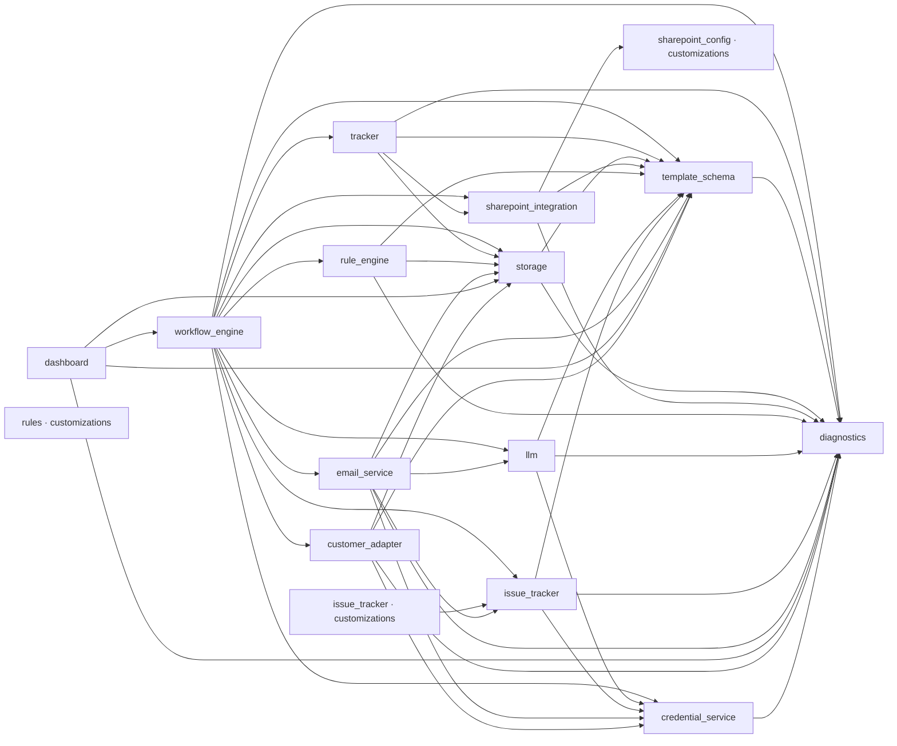

_Generated 2026-06-12 by regen-map. Do not hand-edit._

# Module map

| Module | Purpose | Status |
|---|---|---|
| [credential_service](../../core/src/credential_service/MODULE.md) | Single read-only interface (`get_credential(pm_id, system_type) -> Credential`) that returns the credential material every outbound adapter needs to authenticate against external systems (corp PLM via gateway, customer JIRA, corp messenger via gateway, customer portals, email mailbox, SharePoint service account). | |
| [customer_adapter](../../core/src/customer_adapter/MODULE.md) | Single Protocol-mediated surface (`CustomerAdapter`) for HILDA's outbound carrier submission — upload individual document files (per `[D-054]` — individual files only, never zips) to each carrier's submission destination + emit `CommunicationLog` entries per FR-42. | [DRAFT] |
| [dashboard](../../core/src/dashboard/MODULE.md) | HTTP entry point for HILDA — the FastAPI app that backs `hilda-api`. | [DRAFT] |
| [diagnostics](../../core/src/diagnostics/MODULE.md) | Central registry and schema library for HILDA's chat-mediated collaboration surface. | |
| [email_service](../../core/src/email_service/MODULE.md) | All email-mediated communication for HILDA — inbound owner replies (FR-12), inbound SP-alert notifications (`[D-047]` + FR-84 + FR-87), outbound owner outreach (FR-9), outbound reminders + escalations (FR-10), the FR-52 5-step routing pipeline driver, the FR-85 doc_type classification driver, and the FR-86 storage matrix dispatcher. | [DRAFT] |
| [issue_tracker (core)](../../core/src/issue_tracker/MODULE.md) | Implements the `IssueTracker` Protocol per `[D-008]` — issue-tracking integration for DeliveryItems whose `tracking_modality` includes `CorporatePLM` or `CustomerJIRA` per `[D-037]` (multi-value enum). | |
| [issue_tracker (customizations)](../../customizations/issue_tracker/MODULE.md) | Drop-in directory for proprietary IssueTracker adapters. | |
| [llm](../../core/src/llm/MODULE.md) | Single Protocol-mediated surface (`LLMProvider`) for every runtime LLM call HILDA makes — doc_type classification (FR-85 Step 2), new-vs-revision classification (`[D-039]` Tier-2), attachment routing (step 4 of FR-52 5-step pipeline per `[D-053]`), document quality review (FR-53), and message classification fallback (FR-12 path c per `[D-034]`). | |
| [rule_engine](../../core/src/rule_engine/MODULE.md) | Pure evaluator for HILDA's IF/THEN AutomationRules per `[D-022]` — given a `TriggerEvent` (one of the 15 Ph-1 triggers per FR-28) plus an `EntityRef` (which Customer/Device/Milestone/DeliveryItem the event is about), returns the ordered set of `RuleMatch` tuples that should fire — each carrying an intra-rule-ordered list of `RuleAction`s (Ph-1 subset of FR-29). | |
| [rules (customizations)](../../customizations/rules/MODULE.md) | **Per-deployment drop-zone** for HILDA AutomationRules + polling-schedule rules that `core/src/rule_engine.RuleSet.load` consumes at startup (and on SIGHUP `reload()`) per FR-30. | [DRAFT] |
| [sharepoint_config (customizations)](../../customizations/sharepoint_config/MODULE.md) | **Per-customer-deployment drop-zone** for SP list/column mappings that `core/src/sharepoint_integration/FileBasedListProvider` consumes at startup to translate HILDA's canonical field names to deployment-specific SP internal column names. | [DRAFT] |
| [sharepoint_integration](../../core/src/sharepoint_integration/MODULE.md) | All SharePoint 2017 REST API interaction for HILDA — entity CRUD on SP Lists, NTLM/Kerberos authentication, and the mapping from HILDA's canonical entity fields to customer-deployment-specific SP list names and column names. | |
| [storage](../../core/src/storage/MODULE.md) | Owns HILDA's internal persistence — Postgres (SQLAlchemy 2.x async + Alembic) for the document index, `CommunicationLog`, BATCH-id idempotency cache, FR-31 runtime overrides, and Celery result backend; Redis client (Celery broker Ph-1/Ph-2 per `[D-022]`; cache-only Ph-3+ per `[D-043]`); NSD host-mount client for the two-tree document store per `[D-013]` / `[D-041]`. | |
| [template_schema](../../core/src/template_schema/MODULE.md) | Canonical data model for HILDA's entity hierarchy — Device / Milestone / DeliveryItem (grouped by tg_name) + TG-group metadata (per `(milestone_id, tg_name)`) — and the contract types shared across all runtime modules. | |
| [tracker](../../core/src/tracker/MODULE.md) | `tracker` is HILDA's **DeliveryItem lifecycle orchestrator**. | [DRAFT] |
| [workflow_engine](../../core/src/workflow_engine/MODULE.md) | HILDA's Celery app + central task dispatcher per `[D-022]`. | [DRAFT] |

## Dependency graph



## Project File Structure

_Alphabetical, regenerated by regen-map. Directory descriptions come from MODULE.md Purpose; file descriptions come from the per-language description-source rule in structure-conventions.md._

```
hilda/
├── .clinerules/
│   ├── 00-project.md
│   ├── 01-role.md
│   ├── 02-content-safety.md
│   └── 03-output-discipline.md
├── .gitignore
├── HILDA_Design.md
├── cline-playbooks/
│   ├── README.md
│   ├── debug-pipeline.md
│   ├── develop-issue-tracker-adapter.md
│   ├── ingest-api-spec.md
│   ├── ingest-template.md
│   ├── mapping.md
│   ├── orient.md
│   ├── placeholder-convention.md
│   ├── profile-test-report.md
│   ├── share-back.md
│   └── sp-connect.md
├── config/
│   └── sharepoint_integration.json
├── core/
│   ├── __init__.py
│   ├── src/
│   │   ├── __init__.py
│   │   ├── credential_service/                # Single read-only interface that returns credential material for outbound adapters (corp PLM via gateway, customer JIRA, corp messenger via gateway, customer portals, email mailbox, SharePoint service account).
│   │   │   ├── MODULE.md
│   │   │   ├── __init__.py                    # credential_service — stable read-only credential interface per [D-019] [D-038].
│   │   │   ├── credential_service_cli.py      # credential_service CLI: --diagnostic, --mock, --validate --system <type>.
│   │   │   ├── mock_service.py                # MockCredentialService — in-memory credential store for tests.
│   │   │   ├── protocol.py                    # Credential data types. Anchors [D-019] [D-038]; serves FR-51, FR-42, NFR-3, NFR-4.
│   │   │   ├── qc_templates.py                # CRD QC templates — registered in the central diagnostics QC registry at import.
│   │   │   └── service.py                     # CredentialService Protocol + Ph-1/Ph-2 sops-backed implementation.
│   │   ├── customer_adapter/                  # Single Protocol-mediated surface (CustomerAdapter) for HILDA's outbound carrier submission — uploads individual document files per [D-054] and emits CommunicationLog entries per FR-42.
│   │   │   ├── MODULE.md
│   │   │   └── __init__.py
│   │   ├── dashboard/                         # HTTP entry point for HILDA — the FastAPI app that backs hilda-api.
│   │   │   ├── MODULE.md
│   │   │   └── __init__.py
│   │   ├── diagnostics/                       # Central registry and schema library for HILDA's chat-mediated collaboration surface.
│   │   │   ├── MODULE.md
│   │   │   ├── __init__.py                    # diagnostics — central registry + compact report schemas + QC template base.
│   │   │   ├── diagnostics_cli.py             # diagnostics CLI: --diagnostic / --validate per [D-005].
│   │   │   ├── error_codes.py                 # Central error-code registry for HILDA. Anchors [D-002] NFR-18.
│   │   │   ├── qc.py                          # QC template — fixed-field schema enforcing no-free-text invariant. Anchors [D-002].
│   │   │   └── report.py                      # Compact report types: RPT / MET / FIX / QC. Anchors [D-002] NFR-17.
│   │   ├── email_service/                     # All email-mediated communication for HILDA — inbound owner replies (FR-12), inbound SP-alert notifications, outbound outreach (FR-9), reminders/escalations (FR-10), the FR-52 5-step routing pipeline driver, the FR-85 doc_type classification driver, and the FR-86 storage matrix dispatcher.
│   │   │   └── MODULE.md
│   │   ├── issue_tracker/                     # Implements the IssueTracker Protocol per [D-008] — issue-tracking integration for DeliveryItems whose tracking_modality includes CorporatePLM or CustomerJIRA per [D-037].
│   │   │   ├── MODULE.md
│   │   │   ├── __init__.py                    # issue_tracker — IssueTracker Protocol + adapters. Anchors [D-003] [D-008].
│   │   │   ├── issue_tracker_cli.py           # IssueTracker CLI: --diagnostic, --mock [--dry-run], --contract --adapter <slug>.
│   │   │   ├── jira_adapter.py                # JiraAdapter — IssueTracker Protocol implementation against Jira REST API v2.
│   │   │   ├── mock_adapter.py                # MockIssueTracker — in-memory IssueTracker for unit and integration tests.
│   │   │   └── protocol.py                    # IssueTracker Protocol and all shared data classes. No IO, no network. Anchors [D-008].
│   │   ├── llm/                               # Single Protocol-mediated surface (LLMProvider) for every runtime LLM call HILDA makes — doc_type classification (FR-85 Step 2), new-vs-revision classification ([D-039] Tier-2), attachment routing (step 4 of FR-52 5-step pipeline per [D-053]), document quality review (FR-53), and message classification fallback (FR-12 path c per [D-034]).
│   │   │   ├── MODULE.md
│   │   │   ├── __init__.py                    # llm — single Protocol surface for HILDA runtime LLM calls.
│   │   │   ├── app.py                         # Thin FastAPI surface for hilda-llm-gateway — POST /invoke + GET /health.
│   │   │   ├── backends.py                    # Backend client adapters — Ollama + OpenAI-compatible.
│   │   │   ├── client.py                      # OnPremLLMClient — caller-side thin HTTP client for hilda-api / hilda-worker.
│   │   │   ├── gateway_server.py              # LLMGatewayServer — egress-side LLMProvider (runs inside hilda-llm-gateway).
│   │   │   ├── llm_cli.py                     # llm CLI: --diagnostic / --mock / --invoke / --contract per [D-005].
│   │   │   ├── mock.py                        # MockLLM — in-memory deterministic LLMProvider for tests.
│   │   │   ├── protocol.py                    # LLMProvider Protocol + request/response types. Anchors [D-007] [D-029] [D-052].
│   │   │   ├── qc_templates.py                # LLG QC template — registered in the central diagnostics QC registry at import.
│   │   │   ├── rate_limit.py                  # Per-backend rate limiting per [D-052] — fixed-window counters, NO automatic spillover.
│   │   │   ├── schemas.py                     # Per-TaskKind input/output Pydantic schemas.
│   │   │   └── templates/                     # Jinja2 prompt templates, one per TaskKind.
│   │   │       ├── classify_doc.j2
│   │   │       ├── classify_doc_type.j2
│   │   │       ├── classify_message.j2
│   │   │       ├── review_document.j2
│   │   │       └── route_attachment.j2
│   │   ├── rule_engine/                       # Pure evaluator for HILDA's IF/THEN AutomationRules per [D-022] — given a TriggerEvent (one of the 15 Ph-1 triggers per FR-28) plus an EntityRef, returns the ordered set of RuleMatch tuples that should fire — each carrying an intra-rule-ordered list of RuleActions (Ph-1 subset of FR-29).
│   │   │   ├── MODULE.md
│   │   │   ├── __init__.py                    # rule_engine — pure evaluator for HILDA's IF/THEN AutomationRules per [D-022].
│   │   │   ├── collision_audit.py             # Startup collision audit: RUL-W001 when distinct rule_ids both write UpdateState on the same trigger.
│   │   │   ├── config.py                      # rule_engine operational config — 3-tier precedence per [D-025] + [D-038].
│   │   │   ├── diagnostics_cli.py             # rule_engine diagnostic CLI — --diagnostic / --validate / --explain modes per [D-005].
│   │   │   ├── error_codes.py                 # RUL-prefixed error codes for rule_engine.
│   │   │   ├── evaluator.py                   # Pure trigger -> list[RuleMatch] evaluator.
│   │   │   ├── loader.py                      # YAML rule loader.
│   │   │   ├── models.py                      # Models for rule_engine per MODULE.md Public surface.
│   │   │   ├── orphan_audit.py                # Startup orphan audit per [D-062].
│   │   │   ├── override_store.py              # OverrideStore seam — FR-31 item-level runtime overrides.
│   │   │   ├── pause_state.py                 # FR-31 sub-1 pause/resume read-side.
│   │   │   ├── polling_schedule.py            # Deadline-tiered polling_schedule breakpoint evaluator per FR-23 / FR-55.
│   │   │   ├── qc_templates.py                # RUL QC template — registered in the central diagnostics QC registry at import.
│   │   │   ├── resolver.py                    # Scope-precedence resolver per FR-30 + FR-31.
│   │   │   └── rule_engine_cli.py             # User-facing CLI wrapper for ops debugging per [D-005].
│   │   ├── sharepoint_integration/            # All SharePoint 2017 REST API interaction for HILDA — entity CRUD on SP Lists, NTLM/Kerberos authentication, and the mapping from HILDA's canonical entity fields to customer-deployment-specific SP list names and column names.
│   │   │   ├── MODULE.md
│   │   │   ├── __init__.py                    # sharepoint_integration — SP REST mechanics + HILDA-entity routing.
│   │   │   ├── auth.py                        # SP auth handlers: NoAuth (mock), NTLM, Kerberos.
│   │   │   ├── config.py                      # sharepoint_integration config: GlobalSharePointConfig + ListScope.
│   │   │   ├── error_codes.py                 # SHP-prefixed error codes for sharepoint_integration.
│   │   │   ├── list_crud.py                   # SpCrud: the only public CRUD surface for SharePoint integration.
│   │   │   ├── list_provider.py               # SharePointListProvider Protocol + FileBasedListProvider boilerplate.
│   │   │   ├── mock_server/                   # Mock SharePoint server — REST API stub + web UI.
│   │   │   │   ├── __init__.py                # Mock SharePoint server — REST API stub + web UI.
│   │   │   │   ├── app.py                     # FastAPI app: SP 2017 REST stub + HTML browser UI.
│   │   │   │   └── store.py                   # In-memory SP list store — pluggable backend for the mock server.
│   │   │   ├── sharepoint_integration_cli.py  # sharepoint_integration CLI per [D-005].
│   │   │   └── sp_client.py                   # SpClient: async SP 2017 REST HTTP client.
│   │   ├── storage/                           # Owns HILDA's internal persistence — Postgres for the document index, CommunicationLog, BATCH-id idempotency cache, FR-31 runtime overrides, Celery result backend; Redis client; NSD host-mount client for the two-tree document store per [D-013] / [D-041].
│   │   │   ├── MODULE.md
│   │   │   ├── __init__.py                    # storage — HILDA internal persistence: Postgres, Redis, NSD per MODULE.md.
│   │   │   ├── audit_ops.py                   # CommunicationLog (append-only per NFR-6), FR-31 overrides, folder routing, tag catalog.
│   │   │   ├── config.py                      # storage operational config — 3-tier precedence per structure-conventions Config format.
│   │   │   ├── db.py                          # SQLAlchemy 2.x async engine, session management, and ORM tables.
│   │   │   ├── document_ops.py                # Document index + association operations per FR-13/17/52/55/57/79/83 and FR-61 tokens.
│   │   │   ├── migrations/                    # Alembic migrations (async env; metadata-driven baseline).
│   │   │   │   ├── env.py                     # Alembic async env — target metadata is storage's Base; URL from config -x or env.
│   │   │   │   ├── script.py.mako
│   │   │   │   └── versions/
│   │   │   │       └── 0001_baseline.py       # Baseline schema — all storage tables from Base.metadata.
│   │   │   ├── models.py                      # Canonical storage models per [D-046] — document index, associations, audit, overrides.
│   │   │   ├── nsd.py                         # NSD client per [D-013] / [D-041] — two-tree path model + file operations.
│   │   │   ├── qc_templates.py                # STR QC templates — registered in the central diagnostics QC registry at import.
│   │   │   ├── redis_client.py                # Redis client — broker URL (Ph-1/Ph-2), 24h-capped cache, BATCH-id idempotency.
│   │   │   └── storage_cli.py                 # storage CLI: --diagnostic / --mock / --mock-postgres / --validate / --alembic-roundtrip.
│   │   ├── template_schema/                   # Canonical data model for HILDA's entity hierarchy — Device / Milestone / DeliveryItem (grouped by tg_name) + TG-group metadata — and the contract types shared across all runtime modules.
│   │   │   ├── MODULE.md
│   │   │   ├── __init__.py                    # template_schema — canonical data model for HILDA's entity hierarchy.
│   │   │   ├── enums.py                       # Canonical enums for HILDA's entity hierarchy. Anchors FR-7, NFR-14, [D-011].
│   │   │   ├── error_codes.py                 # TSC-prefixed error codes for template_schema.
│   │   │   ├── models.py                      # Pydantic base models for HILDA entities + CustomerSchema contract.
│   │   │   ├── registry.py                    # Extensibility registries for FR-7, NFR-14.
│   │   │   ├── slug.py                        # Slug convention for path_slug fields. Anchors [D-013].
│   │   │   └── template_schema_cli.py         # template_schema CLI: --diagnostic / --validate per [D-005].
│   │   ├── tracker/                           # tracker is HILDA's DeliveryItem lifecycle orchestrator.
│   │   │   ├── MODULE.md
│   │   │   └── __init__.py
│   │   └── workflow_engine/                   # HILDA's Celery app + central task dispatcher per [D-022].
│   │       ├── MODULE.md
│   │       └── __init__.py
│   └── tests/
│       ├── __init__.py
│       ├── test_credential_service.py         # credential_service tests — protocol, sops service (decrypt patched), mock, CLI, leak checks.
│       ├── test_diagnostics.py                # Unit tests for core.src.diagnostics.
│       ├── test_issue_tracker.py              # Unit tests for core.src.issue_tracker — Protocol, data classes, MockIssueTracker, load_adapter.
│       ├── test_llm.py                        # llm tests — protocol, schemas, MockLLM, gateway init/invoke, rate limiter, client↔gateway round-trip, CLI.
│       ├── test_mock_server.py                # Unit tests for mock SP server (REST + UI).
│       ├── test_rule_engine.py                # Tests for rule_engine models + polling_schedule (Ph-1, rule-engine-v1 strand).
│       ├── test_sharepoint_integration.py     # Unit tests for sharepoint_integration core (no mock server).
│       ├── test_sharepoint_integration_cli.py # Integration tests for sharepoint_integration_cli.
│       ├── test_storage.py                    # storage tests — NSD paths/IO, document index, associations, fan-out, tokens, redis TTL cap, overrides, folder routing, tag catalog, comm-log, CLI smoke.
│       └── test_template_schema.py            # Unit tests for core.src.template_schema.
├── customizations/
│   ├── __init__.py
│   ├── issue_tracker/                         # Drop-in directory for proprietary IssueTracker adapters.
│   │   ├── MODULE.md
│   │   ├── __init__.py
│   │   ├── defecttrack_adapter.py             # DefectTrack IssueTracker adapter — scaffold generated by Teacher LLM.
│   │   └── tests/
│   │       ├── __init__.py
│   │       ├── conftest.py                    # conftest.py — pytest fixtures and CLI options for IssueTracker contract tests.
│   │       └── test_contract.py               # Contract test suite for IssueTracker adapters (C01-C10).
│   ├── rules/                                 # Per-deployment drop-zone for HILDA AutomationRules + polling-schedule rules that core/src/rule_engine.RuleSet.load consumes at startup (and on SIGHUP reload()) per FR-30.
│   │   ├── MODULE.md
│   │   ├── __init__.py
│   │   └── global/
│   │       └── defaults.yaml                  # Global (tier-1) AutomationRules — seeded from rule_engine/MODULE.md worked examples.
│   └── sharepoint_config/                     # Per-customer-deployment drop-zone for SP list/column mappings that core/src/sharepoint_integration/FileBasedListProvider consumes at startup to translate HILDA's canonical field names to deployment-specific SP internal column names.
│       ├── MODULE.md
│       ├── __init__.py
│       └── customers/
│           └── example.yaml                   # Example customer SP config — a shape for TPMs to copy and customize.
├── docs/
│   ├── compact/
│   │   ├── DECISIONS.md
│   │   ├── MAP.md
│   │   ├── PROJECT.md
│   │   ├── STATUS.md
│   │   ├── SYSTEM.md
│   │   ├── design-inputs/
│   │   │   └── HILDA_Design.md
│   │   ├── phases/
│   │   │   ├── architecture.md
│   │   │   ├── development.md
│   │   │   └── requirements.md
│   │   ├── project-init-interview.md
│   │   ├── requirements.md
│   │   ├── strands/
│   │   │   ├── _archive/
│   │   │   │   ├── credential-service-v1-implementation/
│   │   │   │   │   ├── STRAND.md
│   │   │   │   │   ├── decisions-draft.md
│   │   │   │   │   └── journal.md
│   │   │   │   ├── sharepoint-integration-drift-sweep/
│   │   │   │   │   ├── STRAND.md
│   │   │   │   │   ├── decisions-draft.md
│   │   │   │   │   └── journal.md
│   │   │   │   ├── storage-v1/
│   │   │   │   │   ├── STRAND.md
│   │   │   │   │   ├── decisions-draft.md
│   │   │   │   │   └── journal.md
│   │   │   │   └── template-schema-v2-rewrite/
│   │   │   │       ├── STRAND.md
│   │   │   │       ├── decisions-draft.md
│   │   │   │       └── journal.md
│   │   │   ├── dashboard-v1/
│   │   │   │   ├── STRAND.md
│   │   │   │   ├── decisions-draft.md
│   │   │   │   └── journal.md
│   │   │   ├── llm-v1/
│   │   │   │   ├── STRAND.md
│   │   │   │   ├── decisions-draft.md
│   │   │   │   └── journal.md
│   │   │   └── rule-engine-v1/
│   │   │       ├── STRAND.md
│   │   │       ├── decisions-draft.md
│   │   │       └── journal.md
│   │   └── structure-conventions.md
│   └── sp_ui_engineer/
│       ├── DeliveryItem_visibility_review.xlsx
│       └── HILDA_SP_Schema.xlsx
├── pyproject.toml
├── requirements.txt
└── sharepoint/
    ├── REQUIREMENTS.md
    └── SP_UI_summary_requirements.md
```
