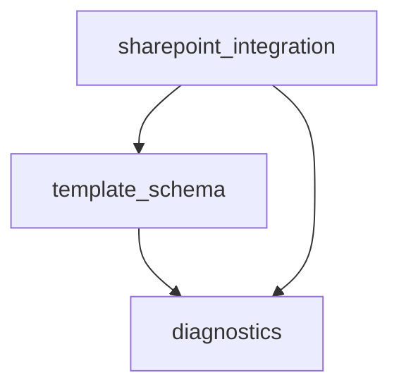

# System map

_Generated 2026-05-04 by regen-map. Do not hand-edit._

## Modules

| Module | Purpose | Status |
|---|---|---|
| [diagnostics](../../core/src/diagnostics/MODULE.md) | Central registry and schema library for HILDA's chat-mediated collaboration surface. | [DRAFT] |
| [sharepoint_integration](../../core/src/sharepoint_integration/MODULE.md) | All SharePoint 2017 REST API interaction for HILDA — entity CRUD on SP Lists, NTLM/Kerberos authentication, and the mapping from HILDA's canonical entity fields to customer-deployment-specific SP list names and column names. | [DRAFT] |
| [template_schema](../../core/src/template_schema/MODULE.md) | Canonical data model for HILDA's entity hierarchy — Device / Milestone / Deliverable / DeliveryItem — and the contract types shared across all runtime modules. | [DRAFT] |

## Dependency graph



## Project file structure

_Alphabetical, regenerated by regen-map. Directory descriptions come from MODULE.md Purpose; file descriptions come from the per-language description-source rule in structure-conventions.md._

```
hilda/
├── HILDA_Design.md
├── core/
│   └── src/
│       ├── diagnostics/              # Central registry and schema library for HILDA's chat-mediated collaboration surface.
│       │   └── MODULE.md
│       ├── sharepoint_integration/   # All SharePoint 2017 REST API interaction for HILDA — entity CRUD on SP Lists, NTLM/Kerberos authentication, and the mapping from HILDA's canonical entity fields to customer-deployment-specific SP list names and column names.
│       │   └── MODULE.md
│       └── template_schema/          # Canonical data model for HILDA's entity hierarchy — Device / Milestone / Deliverable / DeliveryItem — and the contract types shared across all runtime modules.
│           └── MODULE.md
└── docs/
    └── compact/
        ├── DECISIONS.md
        ├── MAP.md
        ├── PROJECT.md
        ├── STATUS.md
        ├── design-inputs/
        │   └── HILDA_Design.md
        ├── phases/
        │   ├── architecture.md
        │   ├── development.md
        │   └── requirements.md
        ├── project-init-interview.md
        ├── requirements.md
        └── structure-conventions.md
```
