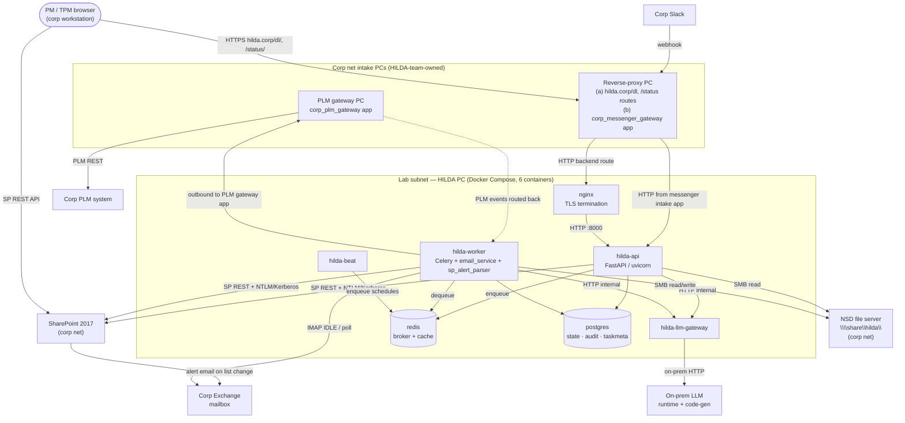

# System Architecture

*Companion to `PROJECT.md` (what / why), `MAP.md` (modules + dependency graph), `structure-conventions.md` (code layout). This doc owns: **process topology, inter-component communication, deployment, observability, secrets flow, CI/CD, egress**. Decisions land as `D-XXX` entries in `DECISIONS.md`; risks land as Flags in `STATUS.md`.*

*Anchors `HILDA_Design.md` §6 (Solution Architecture), §8 (Orchestration), §11 (Deployment), §12 (Configurability). Where this doc deviates from the design input, the conflict is logged below and resolved via `D-XXX`.*

---

## Conflicts with `HILDA_Design.md` (the input was authored before the Ph-1/Ph-2 simplifications)

*Phase mapping for this document: **Ph-1 / Ph-2** = the original "v1" scope (Docker Compose on bare-metal Linux PC per `[D-026]`). **Ph-3+** = the original "v2" scope (MicroK8s single-node per `[D-022]` / `[D-025]` / `[D-043]`). All occurrences below use Ph-1/Ph-2/Ph-3+ terminology.*

| # | Design-input claim | Current state | Resolution |
|---|---|---|---|
| C1 | §6.2 / §7.1 use **Microsoft Graph API** | SP 2017 frozen → REST API + NTLM/Kerberos | Resolved by `[D-006]` |
| C2 | §11 specifies **HashiCorp Vault** for credentials | Ph-1/Ph-2 simplified to sops-encrypted host env-file secrets (bare-metal per `[D-026]` / `[D-038]`); Vault is Ph-3+ target | Resolved by `[D-019]` + `[D-026]` + `[D-038]` |
| C3 | §11 lists **12 separate deployments** (microservices) | Ph-1/Ph-2 = modular monolith, 4 process groups (api / worker / beat / llm-gateway) running as 6 containers (+postgres +redis) on HILDA PC; plus 2 corp-side gateway PCs (reverse-proxy PC for messenger intake + downloads-proxy, PLM gateway PC) per 2026-05-24 review; design-doc 12-pod inventory preserved as Ph-3+ target | Resolved by `[D-021]` (revision pending — see Open Q #11) |
| C4 | §11 specifies **Temporal** as workflow engine | Ph-1/Ph-2 = Celery + Redis broker + Postgres backend; Temporal deferred to Ph-3+ if multi-step durable orchestration emerges | Resolved by `[D-022]` |
| C5 | §11 specifies **Kubernetes** with 12-pod microservices + Helm chart | Ph-1/Ph-2 = Docker Compose on HILDA PC + corp-side gateway apps on 2 additional hosts; MicroK8s single-node + Helm chart is Ph-3+ target for the HILDA PC stack (gateway PCs remain on corp net independent of orchestrator); process boundaries and container image unchanged | Resolved by `[D-026]` + `[D-043]` (revision pending re: gateway PCs — see Open Q #11) |
| C6 | §6.2 / §7.x assume SP-server can call HILDA directly via HTTP for command/refresh actions | SP→HILDA HTTP is firewall-blocked. **SP → HILDA channel is SP alerts → email → HILDA mailbox** per 2026-05-24 review (see §3.1). HILDA → SP unchanged (outbound REST + Kerberos). | Resolved by `[D-006]` + new ADR for SP-alert channel (architecture-phase) |

---

## §1 — Three-pillar topology (stable, anchored in `HILDA_Design.md` §6 as updated 2026-05-24)

```
SharePoint 2017 layer            ← PM / TPM-facing UI + entity row store
        ▲
        │   SP REST API + NTLM/Kerberos  (per [D-006])
        ▼
Automation layer                 ← all HILDA backend services (containerized)
  Ph-1/Ph-2: Docker Compose on bare-metal Linux PC per [D-026]
  Ph-3+:     MicroK8s single-node per [D-022] / [D-025] / [D-043]
        ▲
        │   SMB mount + HILDA-mediated download URLs per [D-013] / NFR-16
        ▼
Network Shared Drive (NSD)       ← all document artifacts per [D-013] / [D-041]
```

- **SharePoint owns** (entity row store): `Customers`, `Devices`, `Milestones`, `DeliveryItems` (no `Deliverables` table per `[D-028]`), `Users`, `PMCredentials` (metadata only — actual creds in sops/Vault per `[D-019]` / `[D-038]`), `CommunicationLog`. `CustomerTemplates` and `AutomationRules` are **not** in SharePoint — they are YAML files (see boundary below). SharePoint Document Libraries are not used for artifacts — superseded by NSD per `[D-013]`.
- **NSD owns** (document store per `[D-013]` / `[D-041]`): all document artifacts (test reports, tech reports, waivers, software binaries, HILDA-generated artifacts). Two-tree structure: `\\share\hilda\inbound\...` (owner drops) + `\\share\hilda\internal\...` (HILDA-classified). HILDA-mediated reads via `https://hilda.corp/dl/<scoped_token>` per NFR-16.
- **Automation layer owns**: every module in `core/src/` and `customizations/`, plus infra services (`postgres`, `redis` in Ph-1/Ph-2; +RabbitMQ in Ph-3+ per `[D-043]`).
- **Boundary** (3-tier storage + 1 document store):
  - **Entity rows** ↔ SharePoint Lists via `core/src/sharepoint_integration/` (SP REST API + NTLM/Kerberos per `[D-006]`)
  - **Configuration** (CustomerTemplates per FR-39/40/41; AutomationRules per FR-30) ↔ YAML files under `customizations/template_schemas/<customer>/` and `customizations/rules/{global,<customer>,<customer>/<device>}/`, bind-mounted into HILDA containers per `[D-025]`, read directly by HILDA — **SharePoint does not read YAML files**
  - **Documents** ↔ NSD via SMB mount; HILDA classifies, writes to `internal/<doc_type_slug>/<doc_id_slug>/revN/`; reads served via HILDA-mediated download endpoint per `[D-013]`
  - **HILDA-internal state** (BATCH-ids, CommunicationLog, idempotency, eval-data, AutomationRule run history, FR-31 runtime overrides) ↔ Postgres
  - No service holds canonical entity state outside SP; no service holds canonical document state outside NSD.

---

## §2 — Process granularity *(Decided — `[D-021]`, platform updated by `[D-026]`)*

**Decision**: modular monolith — **one container image**, **four process groups** deployed as Docker Compose services in Ph-1/Ph-2 (bare-metal Linux PC) and as MicroK8s Deployments in Ph-3+, per `[D-026]` / `[D-043]`:

| Workload | Role | Ph-1/Ph-2 (Compose) | Ph-3+ (MicroK8s replicas) | Hosts which modules |
|---|---|---|---|---|
| `hilda-api` | FastAPI/uvicorn; dashboard backend (FR-56 web-part HTTP surface when on-prem), HILDA-mediated NSD download endpoint per `[D-013]` / FR-61, inbound webhooks (messenger / issue-tracker callbacks); reads from NSD to stream document downloads to PM/TPM browsers | 1 container | 2 | `dashboard`, plus in-process imports of `sharepoint_integration`, `tracker`, `rule_engine`, `template_schema`, `credential_service`, `storage`, `diagnostics` |
| `hilda-worker` | Async-job runner (Celery); scheduled rule firings, mailbox polling (FR-23) and email-channel SP command intake (see §3), ingestor jobs, customer-adapter polling, document classification (FR-52), NSD writes to `internal/<doc_type_slug>/<doc_id_slug>/revN/` per FR-13, blocking IO | 1 container | 2 | `email_service`, `messenger`, `issue_tracker`, `customer_adapter`, `workflow_engine`, all three Ingestor / Profiler modules; same in-process imports as api where shared |
| `hilda-beat` | Celery beat singleton; loads schedule from YAML rule files per `[D-022]` impl note (Device → Customer → Global resolution per FR-30); evaluates deadline-tiered `polling_schedule` for FR-23 / FR-26 / FR-55 | 1 container | 1 | `workflow_engine` (beat schedule loader sub-module) |
| `hilda-llm-gateway` | **Sole egress path to both runtime LLM and on-prem code-gen LLM** per `[D-007]`; **runtime inference** (FR-12 path c, FR-52 Tier-2 classification, FR-53 quality review, FR-54 messenger classification) and **build/ingest-time code-gen** (API Spec Ingestor `[D-003]`, Template Schema Ingestor `[D-010]`, Test Report Profiler `[D-011]`) both route through it; rate-limiting, retries, prompt templates; owns LLM API-key credential | 1 container | 2 | `llm` module |

**Total: 4 HILDA application containers + `postgres` + `redis` = 6 containers in Ph-1/Ph-2; Ph-3+ adds Vault + RabbitMQ.**

### §2.1 — Module roster (18 HILDA-PC modules + 2 corp-side gateway modules = 20 total)

*Modules 1–18 run inside the HILDA PC Docker Compose stack. Modules 19–20 (added during 2026-05-24 review) run on corp-side intake PCs (see §3 boundary clarification). The corp-side modules are HILDA-team-owned but are NOT part of the HILDA PC container set — they have independent deployment lifecycles and warrant their own MODULE.md files.*

| # | Module | Path | Core function | Hosted in workload(s) | Anchors |
|---|--------|------|---------------|-----------------------|---------|
| 1 | `sharepoint_integration` | `core/src/sharepoint_integration/` | SP REST API auth (NTLM/Kerberos), List CRUD, web-part wiring helpers; `SpClient` + `SharePointListProvider` Protocol | api, worker, beat (read) | `[D-004]`, `[D-006]`, `[D-020]` |
| 2 | `tracker` | `core/src/tracker/` | Tracker entity management — Devices / Milestones / DeliveryItems CRUD; tracker creation from template (FR-1/FR-2); per-item state transitions (FR-7) | api | FR-1, FR-2, FR-5, `[D-028]` |
| 3 | `rule_engine` | `core/src/rule_engine/` | Pure-Python IF/THEN rule-condition evaluator; trigger taxonomy + action dispatcher (FR-28); reads resolved AutomationRules with Device→Customer→Global tier per FR-30; applies FR-31 Postgres runtime overrides | api, worker | FR-28, FR-30, FR-31 |
| 4 | `workflow_engine` | `core/src/workflow_engine/` | Celery app + `@hilda_task` decorator (WFL error prefix per `[D-002]`); beat schedule loader (YAML rule files); event dispatcher; deadline-tiered polling_schedule resolver | worker, beat | `[D-022]`, `[D-043]` |
| 5 | `template_schema` | `core/src/template_schema/` | Customer template loader (YAML); per-customer schema validation against template-schema spec; tracker materialization (template → SP List rows) | api, worker | FR-39, FR-40, FR-41, `[D-014]` |
| 6 | `template_schema_ingestor` | `core/src/template_schema_ingestor/` | On-prem LLM ingestion of proprietary customer-template Excel/Word schemas → per-customer Pydantic validators + Excel parsers; dev LLM never reads inputs | worker (CLI) | `[D-010]`, `[D-018]` |
| 7 | `api_spec_ingestor` | `core/src/api_spec_ingestor/` | On-prem LLM ingestion of proprietary API specs (OpenAPI 3.x canonical + preprocessing) → emits adapter code under `customizations/`; dev LLM never reads inputs | worker (CLI) | `[D-003]`, `[D-015]` |
| 8 | `test_report` | `core/src/test_report/` | Per-customer test-report parser invocation; canonical `final \| interim` classifier per FR-16 / FR-46; per-test-case `{passed, failed, non-applicable, waived, not-started}` tuple extraction | worker | FR-16, FR-46, `[D-011]` |
| 9 | `test_report_profiler` | `core/src/test_report_profiler/` | On-prem LLM ingestion of proprietary historical test reports (Excel/Word/PDF) → per-customer deterministic parser code + quality-review checklist; dev LLM never reads inputs | worker (CLI) | `[D-011]` |
| 10 | `credential_service` | `core/src/credential_service/` | Credential storage/retrieval API; Ph-1/Ph-2 = sops-decrypted shared ops-team credential per system per `[D-019]` v1 / `[D-038]`; Ph-3+ = per-PM Vault-backed blobs per `[D-019]` v2 + DEF-14 | api (in-process Ph-1/Ph-2; own service Ph-3+) | `[D-019]`, `[D-038]`, DEF-14 |
| 11 | `email_service` | `core/src/email_service/` | Dedicated mailbox owner; outbound per-owner BATCH-id emails per FR-9 / `[D-012]`; inbound parsing (FR-12 paths a/b/c); **`sp_alert_parser` sub-module** for SP→HILDA command intake via SP alert emails (rule-based, deterministic — see §3.1); mailbox consumption via IMAP IDLE primary / short-interval polling fallback / FR-23 deadline-tiered as third-tier fallback | worker | FR-9, FR-12, FR-23, FR-24, `[D-012]` |
| 12 | `messenger` | `core/src/messenger/` + `customizations/messenger/` | Messenger Protocol `[D-009]`; Slack adapter (public) + proprietary internal messenger adapter (Ingestor-generated); status-only escalation per FR-10; inbound LLM classification per FR-54 (Ph-2). **Inbound from corp Slack arrives via the corp messenger intake app on the reverse-proxy PC (see §3), not directly to `hilda-api`.** | api (receives from intake PC), worker (outbound) | FR-50, FR-54, `[D-009]`, `[D-016]` |
| 13 | `issue_tracker` | `core/src/issue_tracker/` + `customizations/issue_tracker/` | IssueTracker Protocol `[D-008]`; corp PLM adapter (Ingestor-generated, Ph-1 per D-003 impl note); customer Jira adapter (public REST, Ph-1 per FR-25); one PLM issue per (owner × milestone) per `[D-035]`. **Corp PLM access goes through the PLM gateway PC (see §3), not direct from HILDA PC.** | api (receives PLM events relayed by gateway), worker (poll + writes via gateway) | FR-25, FR-26, `[D-003]`, `[D-008]`, `[D-035]` |
| 19 | `corp_messenger_gateway` | corp-net deployment on reverse-proxy PC (HILDA team-owned) | Receives corp Slack webhooks (inbound to corp net, IP/port whitelisted); application-routes by message type; forwards HILDA-bound messages to `hilda-api` over lab subnet HTTP | reverse-proxy PC (corp net) | New module — to be drafted during architecture phase; not in HILDA PC Docker Compose |
| 20 | `corp_plm_gateway` | corp-net deployment on PLM gateway PC (HILDA team-owned) | Bridges HILDA ↔ corp PLM — accepts outbound requests from HILDA workers (proxied through to PLM REST); routes PLM-side events back to HILDA via HILDA-initiated long-poll or persistent connection | PLM gateway PC (corp net) | New module — to be drafted during architecture phase; not in HILDA PC Docker Compose |
| 14 | `customer_adapter` | `customizations/customer_adapters/<vendor>/` | Customer submission system adapter — `{submitItem, getStatus, postComment, uploadAttachment}` surface per FR-19; carrier `portal_structure.yaml` per FR-69; per-customer YAML config | worker (egress) | FR-18, FR-19, FR-20, FR-27, FR-69 |
| 15 | `llm` | `core/src/llm/` | LLMProvider Protocol; routing to runtime LLM (inference) and code-gen LLM (build/ingest); rate-limiting, retries, prompt-template management; LLG error prefix per `[D-002]` | llm-gateway | `[D-007]`, `[D-029]`, `[D-030]`, `[D-034]` |
| 16 | `storage` | `core/src/storage/` | Postgres ORM (SQLAlchemy); Alembic migrations; document index (per-revision rows keyed on `(delivery_item_id, doc_type, doc_id_slug, rev_number)`); CommunicationLog; FR-31 runtime overrides; Redis client for idempotency cache | api, worker, beat | FR-15, FR-31, FR-57, NFR-15 |
| 17 | `diagnostics` | `core/src/diagnostics/` | Central diagnostics per `[D-017]`; compact RPT/MET/FIX/QC report emission per `[D-002]`; per-module `<module>_cli.py` diagnostic mode; no-proprietary-content invariant enforcement | all | `[D-002]`, `[D-005]`, `[D-017]`, NFR-17/18/19 |
| 18 | `dashboard` | `core/src/dashboard/` | FR-56 milestone view backend; FR-57 document enumeration API (`https://hilda.corp/docs/<delivery_item_id>`); FR-61 download endpoint mediation; action handlers (Start Collection, Approve, Submit to Carrier, Close All Items, Send Reminder) | api | FR-56, FR-57, FR-58–FR-65 |

**Key consequences** (full text in `[D-021]`, deployment platform in `[D-026]` — both require revision per 2026-05-24 review; see Open Questions):
- HILDA-PC modules 1–18 are importable from any workload via `core.src.<module>` — process boundary is at start-command level, not Python-package level.
- Corp-side modules 19 (`corp_messenger_gateway`) and 20 (`corp_plm_gateway`) are **separate deployment units on corp-net hosts** (reverse-proxy PC and PLM gateway PC respectively); they communicate with the HILDA PC stack over HTTP. They are HILDA-team-owned (not IT-managed); their own MODULE.md files are architecture-phase deliverables.
- Module Protocol boundaries already in place (`[D-008]`, `[D-009]`, `[D-019]`, `[D-020]`) preserve a mechanical Ph-3+ split path for HILDA-PC modules: extract module + add thin REST surface; call sites don't change.
- Per-customer adapter services deferred until customer 2 (`DEF-8`).
- `credential_service` stays in-process in Ph-1/Ph-2 per `[D-019]`; gets its own pod when Vault swaps in at Ph-3+.
- Each `MODULE.md` adds a curated subsection naming which workload (and which host) hosts it.
- `HILDA_Design.md` §11's 12-pod inventory preserved as Ph-3+ target shape, not Ph-1/Ph-2.
- **`[D-021]` / `[D-026]` framing of "modular monolith on a single bare-metal PC" is now incomplete** — actual deployment surface is 3 HILDA-owned hosts (HILDA PC + reverse-proxy PC + PLM gateway PC). ADR revision flagged.

---

## §3 — Inter-component communication *(follows from §2; corp/lab network boundary clarified during 2026-05-24 review)*

### Network boundary model

HILDA operates across two distinct network zones:

| Zone | Hosts |
|---|---|
| **Corp intranet** | SharePoint 2017 server, corp Exchange mailbox, corp Slack, corp PLM, corp file server (NSD), PM/TPM workstations and their browsers |
| **Lab subnet** | HILDA PC (Docker Compose stack — `hilda-api`, `hilda-worker`, `hilda-beat`, `hilda-llm-gateway`, postgres, redis), on-prem LLM |

**Firewall posture:**
- ✅ HILDA PC → corp (outbound from lab to corp) — allowed; this is how HILDA reaches SP REST, Exchange, SMB-mounted NSD, on-prem LLM endpoint
- ❌ Corp → HILDA PC (inbound from corp to lab over HTTPS/HTTP) — **blocked.** SP server cannot POST to HILDA PC; PM corp browsers cannot directly XHR to HILDA PC
- The corp → lab block is unconditional and applies regardless of physical location of HILDA PC; the constraint is the network zone, not "on-prem vs outside-premises"

Two **corp-side intake PCs** (both running HILDA-team-owned application code) bridge the corp → lab gap where needed:

| Intake PC | Physical | Roles |
|---|---|---|
| **Reverse-proxy PC** (corp net) | Single corp-net host | (a) IT-admin's generic reverse proxy serving non-HILDA services + `hilda.corp/dl/*` and `hilda.corp/status/*` routes that proxy through to `hilda-api` on lab subnet; (b) **corp messenger intake application** — receives corp Slack webhooks, application-routes to `hilda-api` |
| **PLM gateway PC** (corp net) | Dedicated corp-net host (different physical machine) | Bridges HILDA ↔ corp PLM — HILDA outbound calls reach PLM gateway app on this host, which forwards to corp PLM system (and routes inbound PLM events back to HILDA) |

> **Implication for `[D-021]` / `[D-026]`**: the "modular monolith on a single bare-metal PC" framing of those ADRs is no longer complete. The full HILDA deployment surface is now **three hosts**: HILDA PC (lab — 6 containers) + reverse-proxy PC (corp — messenger intake app + reverse-proxy routes) + PLM gateway PC (corp — PLM gateway app). Both intake PCs run HILDA-team-owned code and warrant their own MODULE.md files. ADR revision flagged in Open Questions.

### Communication channel table

| From → To | Mechanism | Notes |
|---|---|---|
| PM browser → SP read/write | Corp browser → SP REST API (corp-to-corp; trivially works) | Web part JS uses this both for initial render and for live-polling SP list fields that HILDA writes back to |
| PM browser → HILDA file download | Corp browser → `hilda.corp/dl/<scoped_token>` → reverse-proxy PC → `hilda-api:8000` on lab subnet → token resolution → NSD read → stream back per FR-61 / NFR-16 | One proxy backend rule for HILDA. PM browser never directly contacts HILDA PC. |
| PM browser → HILDA status poll *(optional)* | Same path as downloads, route `hilda.corp/status/*` → `hilda-api:8000/status/*` | Used only if SP-list-polling pattern (above) is insufficient. The SP-REST-polling pattern is generally preferred and removes the need for this route. |
| SP → HILDA notification (button click, list edit, refresh request) | SP-side action modifies a list field → SP alert fires email → corp Exchange delivers → HILDA `email_service` consumes (IMAP IDLE preferred; short-interval polling fallback) → parses via `sp_alert_parser` sub-module → dispatches Celery task | Stable email format per SP alert template (key:value body, fixed subject prefix `Alert_<List>_<Suffix>`); routing key = `(ProjectID, MinorMilestone, ItemNumber)` |
| HILDA → SP write-back | `sharepoint_integration` library (in-process import) → SP REST API outbound + NTLM/Kerberos per `[D-006]` | HILDA never polls SP — all SP-side change notifications arrive via the email channel above |
| Corp Slack → HILDA | Corp Slack webhook → messenger intake app on reverse-proxy PC (corp net, whitelisted inbound) → application routing → `hilda-api` over lab subnet HTTP | App-layer routing on the intake PC decides what to forward to HILDA |
| HILDA ↔ Corp PLM | HILDA outbound → PLM gateway app on PLM gateway PC (corp net) → corp PLM system; gateway also routes PLM-side events back to HILDA | HILDA PC cannot reach corp PLM directly; PLM gateway PC is the only authorized PLM client |
| Customer JIRA → HILDA | HILDA polls customer JIRA outbound per FR-25 | No inbound webhook; HILDA-initiated polling only |
| `hilda-api` ↔ `hilda-worker` | Celery via Redis broker (Ph-1/Ph-2 per `[D-022]`); RabbitMQ Quorum Queues broker (Ph-3+ per `[D-043]`); results / state in Postgres | Async fan-out for reminders, ingest jobs; scheduled triggers via `hilda-beat` singleton |
| `hilda-api`, `hilda-worker` → `hilda-llm-gateway` | Internal HTTP (Docker DNS Ph-1/Ph-2 / cluster DNS Ph-3+) | Gateway is the sole egress path for both runtime LLM (inference) and code-gen LLM (build/ingest) per `[D-007]` |
| Any HILDA container → Postgres / Redis | Standard drivers, Docker DNS (`postgres` / `redis` hostnames) | Same hostnames in MicroK8s ClusterIP |
| Any HILDA container → NSD | SMB mount (`\\share\hilda\`) using corp credentials; `hilda-worker` writes classified documents to `internal/...` per FR-13; `hilda-api` reads for HILDA-mediated downloads per FR-61 | NSD lives on corp file server, mounted from lab subnet over SMB; `hilda-svc` AD service account holds write permission |

### §3.1 — SP → HILDA channel: SP alert emails (the only inbound from SP)

Because the corp firewall blocks inbound to HILDA PC, **all SP → HILDA notifications travel via email**. The mechanism is SharePoint 2017's built-in **alert** feature — not custom workflow, not Power Automate, just the standard SP alert on the deliverable-tracker list.

**Flow — applies to every SP-side action (button click or direct field edit):**

1. PM/TPM action in SP UI — either a direct list-field edit, or a button click. **Button clicks are wired by the SP UI engineer to modify a list field on click** (button → field write is internal to the SP web part).
2. The field modification triggers the **SP alert** configured for that list → SP server sends a structured email to the HILDA dedicated mailbox (`MNO Central <sharepoint@corp-domain>`).
3. HILDA `email_service` consumes the email via **IMAP IDLE on Exchange** (preferred — latency ~1–2 s on Linux; standard via `imapclient` library) or **short-interval polling** (fallback if IDLE disabled by Exchange admin — e.g., every 5–10 s).
4. The `sp_alert_parser` sub-module (deterministic rule-based regex parser, not LLM) extracts the structured fields from the email body and the action verb from the sub-header line.
5. Routing: `(ProjectID, MinorMilestone, ItemNumber)` is the composite natural key mapping to a DeliveryItem per the FR-5 uniqueness constraints. (Confirm during architecture: is `ItemNumber` immutable, or can it be re-assigned when items are added/removed mid-milestone?)
6. The parser dispatches a Celery task corresponding to the action (`start_collection`, `approve_item`, `download_request`, `manual_field_override`, etc.).
7. Task executes, writes results back to SharePoint via `sharepoint_integration` REST API (outbound — always works).
8. SP web part on PM's browser polls SP REST API (corp-to-corp, sub-second) and re-renders in place when it detects HILDA's write-back — no full page reload needed.

**End-to-end interactive latency**: SP alert ~1 s + Exchange delivery ~1 s + HILDA IMAP IDLE ~1–2 s + task processing seconds-to-minutes + SP REST poll interval. For simple actions, total = 5–15 s of user-perceived latency. The FR-23 **deadline-tiered polling schedule** (60 min baseline / 15 min / 5 min) is a **third-tier fallback only** for the case where neither IMAP IDLE nor short-interval polling is acceptable — it does NOT bound interactive UX latency.

**SP alert email format** (sample-confirmed during 2026-05-24 review):
- Subject: `Alert_<ListName>_<Suffix> - <ItemTitle>` (e.g., `Alert_Tasks_MMK - CQ&RE (was "DI&RT") test plan`)
- Sub-header: `<ItemTitle> has been {added|modified|deleted}` (action verb discriminates create / update / delete events)
- From: `<Display> <sharepoint@corp-domain>` — anti-spoofing check on sender
- Body: deterministic key:value field block (Title, MinorMilestone, ItemNumber, ProjectID, Model, MilestoneGating, TrackingModality, DeliveryState, ExpectedCompletionDate, ActualCompletionDate, DeliveryType, TeamName, PLM, DeliveryURL, ...)
- **SP-side configuration requirement**: the alert must be set to "Send Alerts for These Changes: Anything changes" so all PM/TPM field modifications fire alerts (not just specific columns). Otherwise FR-14 manual overrides will not reach HILDA.

**Schema gaps surfaced from the alert sample** (to be reconciled during architecture):
- `MilestoneGating` (Yes/No) — not currently in HILDA schema; likely a Static field on DeliveryItem indicating whether the item gates milestone closure
- Prototype-vs-`requirements.md` field-name mapping (e.g., `ItemNumber` ↔ `item_no`, `TeamName` ↔ `tg_name`) — resolved either by aligning prototype names to canonical schema or by a name-mapping translation layer in `sp_alert_parser`

**Open**: do we need an outbound queue for SP writes (rate-limit / retry surface), or is in-process retry in `SpClient` (already implemented) enough? Probably enough for Ph-1/Ph-2; revisit if SP throttling shows up.

---

## §4 — Persistence substrate *(workflow engine Decided — `[D-022]` / `[D-043]`; `core/src/storage/MODULE.md` is an outstanding architecture-phase task — the only remaining TBD here)*

| Store | Role | Schema owner |
|---|---|---|
| **SharePoint Lists** | Canonical entity-row store (Customers, Devices, Milestones, DeliveryItems, Users, PMCredentials metadata, CommunicationLog) per `[D-006]` + `HILDA_Design.md` §3.4 (updated 2026-05-24) | Customer YAML in `customizations/sharepoint_config/<customer>.yaml` defines list+column names per `[D-004]` / `[D-020]` |
| **YAML config files** (`customizations/`) | CustomerTemplates per FR-39/40/41 + AutomationRules per FR-30; bind-mounted into HILDA containers per `[D-025]` | Customer-config / template-authoring workflow; canonical schema generated from Pydantic models per `[D-046]` |
| **PostgreSQL** | HILDA-internal state: BATCH-id idempotency, `CommunicationLog` mirror, document index per FR-57, FR-31 runtime overrides, eval-data corrections, AutomationRule snapshot, Celery result backend | Owned by `core/src/storage/` (MODULE.md to be drafted in architecture phase) — Alembic migrations |
| **Redis** (Ph-1/Ph-2) / **RabbitMQ + Redis** (Ph-3+) | Ph-1/Ph-2: (a) Celery broker, (b) short-TTL dedup cache for inbound email idempotency keys per `[D-012]`, (c) rate-limit token buckets. Ph-3+: Celery broker role moves to RabbitMQ Quorum Queues per `[D-043]`; Redis stays cache-only | No durable state — Postgres is authoritative |
| **Shared file system / NSD (`\\share\hilda\`)** | All document artifacts: test reports, tech reports, waivers, software binaries, submission packages per `[D-013]` / `[D-041]`; two-tree structure (`inbound/` owner drops + `internal/` HILDA-classified) | `hilda-svc` AD service writes; HILDA-mediated reads via `https://hilda.corp/dl/<scoped_token>` per NFR-16 |

**Workflow engine** *(Decided — `[D-022]`; Ph-3+ broker migration per `[D-043]`)*: **Celery + Redis broker (Ph-1/Ph-2) / RabbitMQ Quorum Queues (Ph-3+) + Postgres result backend.** `hilda-beat` (singleton) loads schedules from YAML rule files at startup per `[D-022]` impl note (supersedes the original SP `AutomationRules`-list loader) and `SIGHUP`-triggered refresh. Event-triggered rules enqueue Celery tasks directly from the originating handler in `hilda-api`. `core/src/workflow_engine/` owns the Celery app, task decorators wired to `[D-002]` error codes (WFL prefix), beat schedule loader, and event dispatcher; `core/src/rule_engine/` stays a pure-Python rule-condition evaluator.

**DB migration strategy**: Alembic migrations run as part of deploy via `docker compose run --rm hilda-api alembic upgrade head` (Ph-1/Ph-2 deploy script) before services start. In Ph-3+ MicroK8s this becomes an init container on `hilda-api`. Migrations are idempotent and backward-compatible with the running prior version.

---

## §5 — Deployment topology *(Ph-1/Ph-2: Docker Compose on bare-metal — `[D-026]`; Ph-3+: MicroK8s per `[D-021]` / `[D-043]`. Note: actual deployment surface is 3 HILDA-owned hosts, not 1 — see §3 boundary clarification)*

**Ph-1/Ph-2 — three HILDA-owned hosts:**

| Host | Network zone | Role | Deployment artifact |
|---|---|---|---|
| **HILDA PC** | Lab subnet | Docker Compose stack: `hilda-api`, `hilda-worker`, `hilda-beat`, `hilda-llm-gateway`, `postgres`, `redis` (6 containers) — see service table below | `deploy/compose/docker-compose.yaml` |
| **Reverse-proxy PC** | Corp net | (a) IT-admin's generic reverse proxy with HILDA backend rules `hilda.corp/dl/*` and `hilda.corp/status/*` → `hilda-api` on lab subnet; (b) corp messenger intake app receiving Slack webhooks and routing to `hilda-api` | IT-admin manages reverse-proxy config; HILDA team owns messenger intake app code (new module: `corp_messenger_gateway`) |
| **PLM gateway PC** | Corp net | PLM gateway app — HILDA-outbound calls reach this app, which forwards to corp PLM; routes PLM-side events back to HILDA | HILDA team owns the gateway app code (new module: `corp_plm_gateway`) |

**HILDA PC — Docker Compose service inventory:**

| Service | Image | Notes |
|---|---|---|
| `hilda-api` | `hilda:<sha>` | FastAPI/uvicorn; Nginx fronts it on :443; health: `GET /health` |
| `hilda-worker` | `hilda:<sha>` | Celery worker pool; health: `celery inspect ping` |
| `hilda-beat` | `hilda:<sha>` | Celery beat singleton per `[D-022]`; loads schedule from YAML rule files under `customizations/rules/` per `[D-022]` impl note |
| `hilda-llm-gateway` | `hilda:<sha>` | Sole egress to on-prem LLM per `[D-007]`; both runtime inference and code-gen paths; health: `GET /health` |
| `postgres` | `postgres:16` | Volume: `postgres_data`; health: `pg_isready` |
| `redis` | `redis:7-alpine` | No persistence needed; health: `redis-cli ping` |
| `nginx` | `nginx:alpine` | TLS termination (corp cert) + reverse proxy → `hilda-api:8000`; port 443 exposed on host |
| `mock-sharepoint` *(dev/test only)* | `mock-sharepoint:<sha>` | Compose dev profile; `HILDA_SP_SITE_URL=http://mock-sharepoint:8765` |

All services on `hilda_net` Docker bridge network. Service names mirror intended Ph-3+ MicroK8s ClusterIP Service names for zero-rename migration.

**Ph-3+ MicroK8s equivalents (from `[D-021]` / `[D-043]`):**

| Workload | K8s kind | Replicas |
|---|---|---|
| `hilda-api` | Deployment | 2 |
| `hilda-worker` | Deployment | 2 |
| `hilda-beat` | Deployment | 1 |
| `hilda-llm-gateway` | Deployment | 2 |
| `postgres` | StatefulSet | 1 + 1 replica (Rook/Ceph RBD PVC per `[D-043]`) |
| `redis` | Deployment | cache-only role (broker duty moved to RabbitMQ per `[D-043]`) |
| `rabbitmq` *(Ph-3+ only)* | RabbitMQ Cluster Operator | Quorum Queues per `[D-043]` |
| `vault` *(Ph-3+ only)* | StatefulSet | 3 (per `[D-019]` v2) |
| `nginx` → Ingress controller | MetalLB LoadBalancer VIP per `[D-043]` | — |
| per-customer adapter *(deferred, DEF-8)* | Deployment | 1 each |

---

## Topology diagram

Process-level view of Ph-1/Ph-2. Shows the corp/lab network zones, the two corp-side intake PCs, and the HILDA PC Docker Compose stack. Arrow direction = TCP connection initiator. All cross-zone arrows respect the firewall posture in §3 (HILDA-PC-initiated outbound to corp is allowed; corp-to-HILDA-PC inbound is blocked).



**Notes on the diagram:**
- Dashed arrow `PLMGW -.-> WORKER` is the PLM gateway routing inbound PLM events back to HILDA (mechanism: HILDA-initiated long-poll or persistent connection — same outbound-only firewall posture as the rest of HILDA's inbound paths)
- Reverse-proxy PC is shown as a single node but plays two distinct roles (downloads-proxy and messenger-intake-app) per §3
- The SP-alert-email path is the only SP → HILDA channel; no direct corp-SP → HILDA HTTP arrow exists because that path is firewall-blocked

**Ph-3+ MicroK8s migration**: lab subgraph becomes MicroK8s overlay network; `nginx` container → Ingress controller behind MetalLB VIP; Docker service names preserved as ClusterIP Service names; Redis-as-broker → RabbitMQ Quorum Queues per `[D-043]`; reverse-proxy PC and PLM gateway PC topology unchanged (those are corp-net hosts independent of HILDA's orchestrator); process boundaries and connection directions otherwise unchanged.

---

## §6 — Observability *(Decided — `[D-023]`)*

**Decision**: light stack, zero new HILDA-owned services, dashboards/alerts as code under `deploy/`.

**Three signal channels:**
- **Logs** — structured JSON to stdout from every container; host log forwarder ships to corp log store. Required fields: `ts`, `level`, `service`, `module`, `error_code`, `run_id`, `pm_id` (never credentials).
- **Metrics** — `/metrics` endpoint per container via `prometheus_client`. Required families: `hilda_request_total`, `hilda_celery_tasks_total`, `hilda_pipeline_errors_total{code}` (the `[D-002]` integration), `hilda_llm_calls_total`, `hilda_sp_request_total`, `hilda_credential_expiry_seconds`, `hilda_queue_depth`, `hilda_adapter_retry_total`, plus latency histograms.
- **Compact reports** — RPT / MET / FIX / QC per `[D-002]`, persisted in `CommunicationLog` (Postgres). Domain audit trail; orthogonal to logs/metrics.

**Dashboards-as-code** in `deploy/grafana/dashboards/`: `system_overview.json`, `error_codes.json`, `workers_and_queues.json`, `llm_gateway.json`, `sharepoint_integration.json`. Imported into corp Grafana, not run by HILDA.

**Alerts-as-code** in `deploy/prometheus/alerts/hilda.yaml`: rules keyed on `[D-002]` error-code rate (e.g. `SHP-E*` > N/min for 5m → page).

**Not in Ph-1/Ph-2**: HILDA-owned Grafana / Loki / Tempo / OTel collector / distributed tracing. Tracing follow-up `D-XXX` if cross-service debugging pain emerges; revisit at Ph-3+ alongside MicroK8s rollout.

**Implementation seam**: `core/src/observability/` (or extension of `diagnostics/`) provides Prom client setup + log formatter + standard metric registry; `[D-002]`'s `PipelineError` raise path auto-increments `hilda_pipeline_errors_total{code}`.

---

## §7 — Secrets + config flow *(Ph-1/Ph-2 updated by `[D-026]` + `[D-038]`; Ph-3+ Vault per `[D-019]` v2)*

```
              sops-encrypted .env (Ph-1/Ph-2 — repo-committed, decrypted at deploy time per [D-038])
                      ↓
              /etc/hilda/<service>.env (decrypted, host file, gitignored)
                              │
                              │  env_file: in Compose (Ph-1/Ph-2)
                              │
              Vault K/V (Ph-3+ — per [D-019] v2, MicroK8s Secret / envFrom: secretRef)
                              │
                              ▼
              GlobalSharePointConfig.from_sources()
                              │  3-tier: CLI overrides > env > config file > defaults
                              ▼
                       SpClient / etc.
```

- **Ph-1/Ph-2 secrets**: per-service `.env` files at `/etc/hilda/<service>.env` on the bare-metal host, **sops-encrypted with age keys** per `[D-038]` (repo-committable encrypted form); decrypted at deploy time by ops via `sops --decrypt`; runtime files are gitignored; env var names (`HILDA_SP_PASSWORD`, `HILDA_LLM_API_KEY`, etc.) are identical to what Ph-3+ MicroK8s Secrets / Vault will set — zero code change for migration. Ph-1/Ph-2 also uses a **single shared HILDA ops-team credential set per customer system** per `[D-019]` v1 — not per-PM.
- **Ph-3+ MicroK8s Secrets + Vault**: per `[D-019]` v2 — HashiCorp Vault holds encrypted per-PM credential blobs; the Credential Service pod retrieves them at request time; MicroK8s Secrets used for service-level secrets (SP service-account keytab, LLM API key, RabbitMQ creds). One Secret per logical credential, mounted only into pods that need it. Env var names unchanged from Ph-1/Ph-2.
- **ConfigMaps** (`config/<module>.json` files): per-module operational settings, baked into image; mountable as MicroK8s ConfigMap in Ph-3+ without code change.
- **Customer YAML** (`customizations/sharepoint_config/`, `customizations/template_schemas/`, `customizations/rules/`): list/column maps per `[D-004]` + `[D-020]`; CustomerTemplates per FR-39/40/41; AutomationRules per FR-30. Ph-1/Ph-2 = Docker bind-mount from host at `./customizations/` → `/app/customizations/` (allows adding a customer or rule without image rebuild); Ph-3+ = MicroK8s ConfigMap at same container path. Per `[D-025]`.

**Pattern is stable**; the `sharepoint_integration` module already implements it correctly via `from_sources()`. Each new module follows the same shape.

---

## §8 — CI/CD + environments *(Shape Decided — `[D-024]`; phase split per PROJECT.md update 2026-05-24)*

**Phase scope:**
- **Ph-1/Ph-2** — **CI only** (test running on commits + image build + vulnerability scan). **Deployment is manual/scripted by ops**: `git pull` on the bare-metal host → `sops --decrypt` → `docker compose pull && docker compose up -d` → run Alembic migrations. No CD pipeline tooling.
- **Ph-3+** — **Full CI/CD pipeline per `[D-024]`** lands alongside MicroK8s rollout: automated deployment via Helm to MicroK8s; promote-to-prod gates; environment-specific values files.

> **Open follow-up**: `[D-024]` currently describes the CI/CD shape with a Helm-based umbrella chart — which assumes MicroK8s. With the Ph-1/Ph-2 = Docker Compose / Ph-3+ = MicroK8s split, `[D-024]` needs reconciliation: either supersede with a phase-split decision or append an implementation note pinning the Helm-based pipeline to Ph-3+ and the Compose-based manual-deploy to Ph-1/Ph-2. Tracked in STATUS.md.

**Ph-1/Ph-2 pipeline shape (CI-only):**
- **PR**: lint + unit tests + integration tests against in-process mock SP + image build + vulnerability scan
- **Merge to main**: tag image `hilda:<git-sha>`, push to corp registry
- **Deploy**: manual — ops runs `deploy/scripts/deploy.sh` on the bare-metal host

**Ph-3+ pipeline shape (CI+CD):**
- All Ph-1/Ph-2 CI steps, plus:
- **Merge to main**: deploy image to test env via Helm to MicroK8s; smoke tests
- **Promote to prod**: manual; re-tag with semver; Helm upgrade to prod; smoke tests; gate on success
- **Image versioning**: SHA tag for dev/test (immutable); semver tag for releases. `latest` never used in any deploy manifest

**Ph-1/Ph-2 deploy artifacts (Docker Compose on bare-metal):**
- `deploy/compose/docker-compose.yaml` — base Compose file (all services)
- `deploy/compose/docker-compose.dev.yaml` — dev overrides (mock SP service, debug ports)
- `deploy/compose/.env.example` — env var template (actual `.env` files sops-encrypted in repo per `[D-038]`; decrypted runtime files gitignored)
- `deploy/scripts/deploy.sh` — deploy script: `git pull` → `sops --decrypt` → `docker compose pull` → `docker compose up -d` → run Alembic migrations
- Mock SP runs as the `mock-sharepoint` service (dev Compose profile); test env points `HILDA_SP_SITE_URL=http://mock-sharepoint:8765`

**Ph-3+ deploy artifacts (MicroK8s Helm — placeholder in Ph-1/Ph-2):**
- `deploy/charts/hilda/` — umbrella Helm chart per `[D-024]`, preserved as Ph-3+ migration target; Ph-1/Ph-2 contains only a `README.md` placeholder
- Per-environment values files (`values-dev.yaml` / `values-test.yaml` / `values-prod.yaml`) to be added when migrating to MicroK8s

**Tool-bound choices — TBD pending corp-ops consultation** (tracked as `STATUS.md` Flag):
- CI runner — GitHub Actions / GitLab CI / Jenkins / corp-specific
- Image registry — Harbor / Artifactory / Nexus / corp-specific
- Deploy trigger — manual SSH + `deploy.sh` vs CI-push webhook to bare-metal host (Ph-1/Ph-2); Helm release pipeline (Ph-3+)

These are parameters in the pipeline shape; resolved via follow-up `D-XXX` once corp ops is consulted.

---

## §9 — Networking + egress *(Ph-1/Ph-2: Docker Compose bridge network — `[D-026]`; Ph-3+: MicroK8s NetworkPolicy — TBD)*

**Ph-1/Ph-2 — Docker Compose on bare-metal:**
- **Inbound**: `nginx` container on `hilda_net` handles TLS termination (corp cert) and proxies `hilda.corp/...` → `hilda-api:8000` on the Docker bridge network. Port 443 exposed on host **within the lab subnet only** (corp → lab inbound is firewall-blocked unconditionally per §3 — corp browsers reach HILDA via the reverse-proxy PC on `hilda.corp/dl/*` and `hilda.corp/status/*`, not directly).
- **Internal**: single Docker bridge network `hilda_net`; all services reachable by service name (Docker DNS). Service names chosen to match intended Ph-3+ MicroK8s ClusterIP Service names: `hilda-api`, `hilda-worker`, `hilda-beat`, `hilda-llm-gateway`, `postgres`, `redis`.
- **Outbound**:
  - SP, email server, internal messenger/issue-tracker → from containers via host network stack (corp network reachable from bare-metal host).
  - Runtime LLM (`[D-007]`) → `hilda-llm-gateway` container only; other containers cannot reach the LLM endpoint without going through `hilda-llm-gateway`'s HTTP surface.
  - Customer systems (Jira/portal): per-customer adapter service, egress via corp proxy configured in container env.
  - NSD (`\\share\hilda\`): SMB mount on the host, exposed to `hilda-api` and `hilda-worker` containers via volume mount.
- **No app code makes direct external calls** — always through a designated service (`hilda-llm-gateway` for LLM; `sharepoint_integration` lib for SP).

**Ph-3+ MicroK8s (migration target):**
- `nginx` container → Ingress controller (corp default); TLS at ingress; MetalLB LoadBalancer VIP per `[D-043]`
- `hilda_net` Docker bridge → MicroK8s overlay network + ClusterIP Services (service names preserved)
- LLM egress restriction → MicroK8s NetworkPolicy (only `hilda-llm-gateway` pod egresses to LLM host)
- NSD SMB access → CSI driver for SMB; PV/PVC per `[D-043]`
- Full NetworkPolicy set to be decided as `D-XXX` when migrating to MicroK8s

---

## Open system-architecture questions

*(Running list — items resolve via `D-XXX` entries; backlogged items become `STATUS.md` Flags.)*

1. ~~**Process granularity** (§2)~~ — *resolved by `[D-021]`: modular monolith with four workloads (api / worker / beat / llm-gateway).*
2. ~~**Workflow engine** (§4)~~ — *resolved by `[D-022]`: Celery + Redis broker + Postgres backend; Ph-3+ broker migration to RabbitMQ Quorum Queues per `[D-043]`; Temporal deferred.*
3. ~~**Observability stack** (§6)~~ — *resolved by `[D-023]`: light stack, zero HILDA-owned services, dashboards/alerts-as-code under `deploy/`.*
4. **CI runner + image registry + deploy trigger** (§8) — *partially resolved by `[D-024]` + `[D-026]`: pipeline shape decided; CI-only in Ph-1/Ph-2 with manual deploy; full CI/CD in Ph-3+; specific tool choices (CI runner, registry, deploy trigger mechanism) remain a `STATUS.md` Flag pending corp-ops consultation.*
5. ~~**Helm chart granularity** (§8)~~ — *resolved by `[D-024]` + `[D-026]`: Helm chart preserved as Ph-3+ placeholder at `deploy/charts/hilda/`; Docker Compose is Ph-1/Ph-2 deploy artifact.* **Follow-up**: `[D-024]` Helm-based shape needs phase-split impl note (Ph-3+ only) — see §8 callout.
6. ~~**Customer YAML mount** (§7)~~ — *resolved by `[D-025]`: Ph-1/Ph-2 Docker bind-mount from host; Ph-3+ MicroK8s ConfigMap at same container path.*
7. **Email service split** (§2) — own service or in `hilda-worker`. Decide when `email_service/MODULE.md` is drafted.
8. **Per-customer adapter services** (§5) — deferred until customer 2.
9. ~~**Deployment platform Ph-1/Ph-2**~~ — *resolved by `[D-026]`: Docker Compose on single bare-metal Linux PC; MicroK8s is Ph-3+ target per `[D-043]`; process boundaries, container image, and task architecture unchanged.*
10. ~~**SP↔HILDA channel mode**~~ — *Resolved during 2026-05-24 review: SP → HILDA HTTP is firewall-blocked unconditionally; SP → HILDA channel is SP alerts → email → HILDA mailbox (see §3.1). New ADR pending to lock down the SP-alert email channel + sp_alert_parser sub-module.*
11. **`[D-021]` / `[D-026]` revision — 3-host deployment surface** (§2 / §5) — current ADRs frame Ph-1/Ph-2 as "modular monolith on a single bare-metal PC." Actual surface is 3 HILDA-owned hosts: HILDA PC + reverse-proxy PC (messenger intake + downloads proxy) + PLM gateway PC. ADR revision or supersession required; new modules (`corp_messenger_gateway`, `corp_plm_gateway`) added in §2.1.
12. **IMAP IDLE on corp Exchange** (§3.1) — confirm with Exchange admin whether IMAP IDLE (or EWS streaming notifications) is permitted from HILDA PC for the `email_service` mailbox. If yes → IDLE primary, latency ~1–2 s. If no → short-interval polling fallback (5–10 s). Either way, FR-23 deadline-tiered schedule is the third-tier fallback only.
13. **SP-list schema additions surfaced by alert sample** (§3.1) — `MilestoneGating` field present in SP alert emails but not in current HILDA DeliveryItem schema; needs to be added (or explicitly excluded) during architecture phase. Prototype-vs-`requirements.md` field-name reconciliation also needed.
14. **`ItemNumber` stability** (§3.1) — confirm with SP UI engineer whether `ItemNumber` is immutable for the life of a delivery item, or can be re-assigned when items are added/removed mid-milestone. If unstable, the SP-list needs a hidden immutable `item_guid` column (populated on item creation, included in alert emails) to provide a stable routing key.
15. **SP alert "Send Alerts for These Changes" setting** (§3.1) — must be configured to "Anything changes" so all PM/TPM field modifications fire alerts. SP-side deployment configuration requirement — flag in deployment runbook.
16. **`[D-024]` CI/CD reconciliation** — currently describes Helm-based pipeline (assumes MicroK8s). Ph-1/Ph-2 = Docker Compose with manual deploy; full CI/CD per `[D-024]` lands at Ph-3+. ADR needs implementation note pinning Helm pipeline to Ph-3+.

---

## How this doc evolves

- Decisions made: append a row to the "Conflicts" table if the resolution overrides `HILDA_Design.md`; cross-link to `D-XXX`.
- Section moves from "TBD" to "Decided" when its `D-XXX` lands. Update prose accordingly; do not delete the rationale — replace with a one-line summary linking the `D-XXX`.
- Topology diagram: present above (added 2026-05-08). Keep MAP.md's module-graph Mermaid separate; SYSTEM.md's diagram is process-level.
- This file is hand-curated (peer of `structure-conventions.md`), not regenerated.
